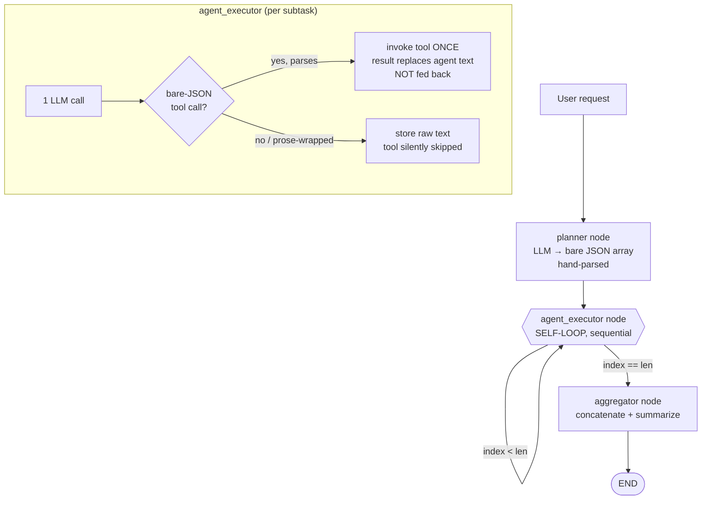

# Lab Wiki — Multi-Agent Task Solver (MATS)

> The growing brain of this repo. **Anchor sections** at the top hold current truth (edit in place). The **Log section** at the bottom is append-only, newest on top. To supersede a claim: edit the anchor in place AND append a dated Log entry (`./log.sh "<entry>"`). Concreteness rule: every Log entry carries a number, step, or sample count.

## Quick links

- [Architecture](#architecture)
- [Diagrams](#diagrams)
- [Active Conventions](#active-conventions)
- [Gotchas](#gotchas)
- [Open Questions](#open-questions)
- [Companion docs](#companion-docs)
- [Log](#log)

### Companion docs
- [docs/PRD.md](docs/PRD.md) — product requirements (stable `FR-*`/`NFR-*` IDs)
- [docs/critical-analysis.md](docs/critical-analysis.md) — 64 verified findings (3 critical / 27 high / 27 medium / 7 low)
- [docs/implementation-plan.md](docs/implementation-plan.md) — phased roadmap M0→M4 to close the gaps
- [docs/testing-plan.md](docs/testing-plan.md) — iterative test & eval strategy
- [README.md](README.md) · [SEARCH_TOOLS.md](SEARCH_TOOLS.md) · [CHANGELOG.md](CHANGELOG.md) — note: several README/QUICK_REFERENCE claims are **inaccurate** (see Gotchas & critical-analysis docs-1…docs-8)

---

## Architecture

What's true *now* about how this system is built (the Oct 2025 MSP-1 prototype). Why each choice was made lives in the [Log](#log).

- **Stack:** FastAPI (`main.py`) + LangGraph orchestrator (`orchestrator.py`) + tools (`tools.py`) + env config (`config.py`) + a static polling UI (`static/index.html`). → see Log 2026-06-25 *baseline-audit*
- **Graph shape:** `planner → agent_executor (self-looping) → aggregator → END`. The executor is **one node** that processes `subtasks[current_subtask_index]`, increments the index by 1, and conditionally loops back to itself. Execution is therefore **strictly sequential** — there is no fan-out, `asyncio.gather`, or LangGraph `Send` (the README's "parallel" claim is false). → see Log 2026-06-25 *baseline-audit*
- **Agents:** `planner`, `researcher`, `summarizer`, `data_analyst`, `code_executor`, `aggregator`. Each "specialized" agent is steered by a **single hard-coded sentence**; behavior differs mostly via the user-message template, not real role engineering. → see Log 2026-06-25 *baseline-audit*
- **Tool protocol (hand-rolled, fragile):** the planner is *prompted* to emit a bare JSON array; agents are *prompted* to emit a bare `{"tool","input"}` object. Both are parsed with `json.loads` (planner strips markdown fences; the executor does **not**). No native function-calling / structured outputs. An agent does **one** LLM call + **at most one** tool call; the tool result is **not** fed back to the model — no ReAct loop. → see Log 2026-06-25 *baseline-audit*
- **Tools:** `web_search_tool` (cascading Tavily → Perplexity → DuckDuckGo, in `tools.py`), `python_executor_tool` (in-process `exec()` — **no sandbox**, RCE), `file_io_tool` (read/write/append to **any** path — no confinement). → see Log 2026-06-25 *security-criticals*
- **LLMs:** OpenAI via `ChatOpenAI`; Gemini via **Vertex AI** (`ChatVertexAI`, needs ADC + GCP project) — but the code gates Gemini on `GOOGLE_API_KEY` (an AI-Studio key Vertex never uses) and passes `project_id=` (wrong kwarg; silently dropped). The genai/AI-Studio path is commented out. → see Log 2026-06-25 *gemini-auth-mismatch*
- **State & lifecycle:** an in-memory `task_storage` dict; tasks run as FastAPI `BackgroundTasks`; the UI **polls every 3s**. No persistence, no auth, no rate limiting, no observability/tracing/cost accounting. → see Log 2026-06-25 *baseline-audit*

---

## Diagrams

Current control flow (keep this diagram and the Architecture prose in sync — update both together):



Target topology (where we're going — see [implementation-plan.md](docs/implementation-plan.md)): `planner(structured-output) → [clarifier w/ interrupt] → dispatcher(DAG fan-out, bounded concurrency) → ReAct executor(bind_tools + ToolNode loop) → verifier/reflection → aggregator`, compiled with a **durable checkpointer**, streamed over **SSE**, behind **auth + sandboxed tools**.

---

## Active Conventions

The conventions any contributor must currently honour. When one changes, edit here in place AND append a Log entry.

- **Wiki discipline.** Anchors = current truth (edit in place); Log = append-only, newest on top via `./log.sh "<entry>"`. Every Log entry contains a number/step/sample count. Log-before-act for non-trivial decisions.
- **Requirement & finding IDs are stable handles.** Reference product requirements as `FR-*`/`NFR-*` (see [PRD](docs/PRD.md)) and audit findings as `<dim>-N` (e.g. `tool-1`, `bug-2`; see [critical-analysis](docs/critical-analysis.md)). Tests and plan items cite these IDs.
- **Evidence rule.** Every claim about the code cites `file:line`. Audit findings were adversarially verified against the actual source before being recorded.
- **Security-by-default until hardened.** `python_executor_tool` (RCE) and `file_io_tool` (arbitrary path) are **unsafe**; do **not** expose this service beyond `localhost` to any untrusted caller until sandboxing + auth land (Phase 0/2). Treat web-search results as a prompt-injection vector that can reach those tools.
- **Docs must match code.** Eight doc-vs-code contradictions are open (`docs-1…docs-8`); when you touch a claim, reconcile the doc and the code in the same change.

---

## Gotchas

Sharp edges that will bite a contributor. (Severity/IDs map to [critical-analysis.md](docs/critical-analysis.md).)

- **Tools usually never fire.** A subtask's tool runs only if the model's *entire* reply is bare JSON; any prose or ```` ``` ```` fence makes `json.loads` raise, the `except` swallows it (`pass`), and the (possibly hallucinated) text is stored as the result — no log that a tool was skipped. (`bug-3`, `agent-3`)
- **A malformed tool input crashes the whole task.** The tool-call block catches only `json.JSONDecodeError`; a wrong-shaped `tool_input` (the model is never told arg schemas) or any tool exception propagates out and aborts the task with `result=None` — no partial output. (`bug-2`, `bug-4`, `bug-6`)
- **Selecting Gemini "works" only by accident.** `main.py` never forwards `use_gpt4/use_gemini` into `execute_task`, so preference is always computed as `gpt4`; a Gemini-only run succeeds only via `get_llm`'s fallback, and "both" silently runs GPT-4 only. (`api-8`, `cfg-5`, `cfg-6`)
- **`GEMINI_PROJECT_ID` is silently ignored.** It's passed as `project_id=` but `ChatVertexAI`'s kwarg is `project`; with `extra='ignore'` it's dropped, so the project comes from ambient ADC. (`cfg-1`)
- **Plans with ~24+ subtasks crash.** The self-loop is one superstep per subtask; LangGraph's default `recursion_limit=25` raises `GraphRecursionError`. Nothing caps planner output length. (`orch-7`)
- **The progress log is empty.** `progress_callback` reads `value.get('subtask_description')`, but no node return ever has that key, so every entry is `"Node: agent_executor - "`. (`bug-5`, `orch-3`)
- **Dead config knobs.** `MAX_CONCURRENT_AGENTS` and `AGENT_TIMEOUT` are defined/documented but referenced nowhere — there is **no** timeout on any LLM/tool call and no concurrency cap. A hung tool blocks forever. (`orch-2`, `tool-5`, `api-5`)
- **`astream` fallback re-runs everything.** If no `aggregator` event is seen, `execute_task` calls `ainvoke` again — a full duplicate graph run (duplicate LLM cost). (`orch-8`)
- **No multi-worker.** `task_storage` is process-local; `uvicorn --workers>1` or multiple replicas → status polls 404. (`api-2`)

---

## Open Questions

Decisions still pending. Each carries a **priority**, a **revisit trigger** (observable event that should make us pick it up), and a **next step**.

- **`[HIGH]` Deployment surface & exposure.** Is MATS a single-tenant localhost tool, an internal service, or a multi-tenant SaaS? *Revisit when:* anyone proposes hosting it or exposing the API off-localhost. *Next step:* decide tenancy before Phase 2; today the unauth endpoint + RCE/file tools make any network exposure unsafe (`tool-3`, `api-3`).
- **`[HIGH]` Code-execution sandbox technology.** gVisor/Firecracker microVM vs one-shot Docker (`--network=none`, read-only rootfs, rlimits) vs hosted (E2B/Modal/Daytona)? *Revisit when:* starting Phase 2 hardening, or before re-enabling `python_executor_tool`. *Next step:* spike one option behind a feature flag; until then keep code-exec disabled/gated (`tool-1`, `tool-5`).
- **`[HIGH]` Gemini auth path.** Standardize on **Vertex AI** (ADC + `project` + `location`) or **AI Studio** (`langchain-google-genai` + `GOOGLE_API_KEY`)? Current code mixes both and works on neither per the docs. *Revisit when:* a non-GPT model is actually needed in a run. *Next step:* pick one, fix `validate()` + docs to match (`cfg-1`, `cfg-2`, `docs-7`).
- **`[MED]` Framework strategy.** Keep the bespoke LangGraph wiring or adopt prebuilts (`create_react_agent`, supervisor/plan-execute patterns, `bind_tools`/`with_structured_output`)? *Revisit when:* starting Phase 1 (correctness). *Next step:* prototype the executor as a ReAct `ToolNode` loop and compare (`sota-1`, `sota-2`, `orch-6`).
- **`[MED]` Parallelism model.** Should the planner emit a dependency DAG so independent subtasks run concurrently (honoring `MAX_CONCURRENT_AGENTS`), or stay sequential? *Revisit when:* a real task has independent subtasks and latency matters. *Next step:* add `depends_on` to the plan schema; fan out a DAG level with a semaphore (`orch-1`, `sota-4`, NFR-5).
- **`[MED]` Eval dataset ownership.** Who curates the golden task set (UC1–UC6) and rubrics for the LLM-as-judge regression evals? *Revisit when:* Phase 1 changes prompts/models. *Next step:* seed ~15 representative tasks with expected-shape rubrics (`sota-7`; see [testing-plan](docs/testing-plan.md)).
- **`[MED]` Persistence/runtime choice.** Postgres + LangGraph `PostgresSaver` vs Redis vs a queue (Celery/arq) for durable, resumable, multi-worker runs? *Revisit when:* moving off a single dev process. *Next step:* introduce a task-store interface so the backend is swappable (`api-1`, `api-2`, `sota-8`).
- **`[LOW]` Dual-model ensemble.** Keep the "use both models" affordance and implement real reconciliation (vote/judge/per-role routing), or remove it? *Revisit when:* model-quality disputes arise. *Next step:* default to per-role single-model routing; defer ensembling (`cfg-5`).
- **`[LOW]` MCP tool integration.** Adopt `langchain-mcp-adapters` for dynamic external tool discovery? *Revisit when:* we need tools beyond the fixed three. *Next step:* none until the tool protocol is moved to native function-calling (`sota-10`).

---

## Log

> Append-only. Newest on top. Append via `./log.sh "<entry>"`. Concreteness rule: every entry has a number, step, or sample count.

### 2026-06-25

*baseline-audit* — Ran an 8-dimension codebase audit (orchestration, agent-design, tools/security, correctness, backend/API/state, config/models, docs-vs-code, SOTA-gaps) with adversarial per-finding verification: **72 agents, ~1.08M tokens, 384 tool calls, 64 findings, 0 refuted** — 3 critical, 27 high, 27 medium, 7 low. Full evidence-backed list in [docs/critical-analysis.md](docs/critical-analysis.md). Established this WIKI + companion docs (PRD, implementation-plan, testing-plan) as the iteration backbone. No code changed.

*security-criticals* — Confirmed 3 criticals that gate any network exposure: `tool-1` in-process `exec()` RCE (empty globals do **not** isolate — real `__builtins__` injected), `tool-2` arbitrary-path file read/write/append (no `..`/abs-path confinement; `write()` even `makedirs` the parent), `tool-3` both reachable from the unauthenticated `POST /api/tasks` bound to `0.0.0.0` and via indirect prompt injection through web-search results. Mitigation sequenced in implementation-plan Phase 0/2.

*gemini-auth-mismatch* — `Config.validate()` accepts `GOOGLE_API_KEY` as the Gemini gate, but `ChatVertexAI` authenticates via ADC + project, never that key; `project_id=` is the wrong kwarg (`project`) and is silently dropped; the AI-Studio client is commented out. Net: following the README cannot produce a working Gemini path. Open Question raised (`[HIGH]` Gemini auth path).
